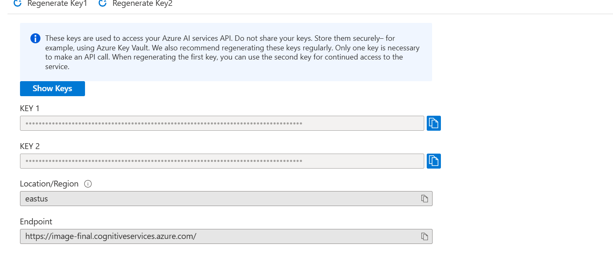
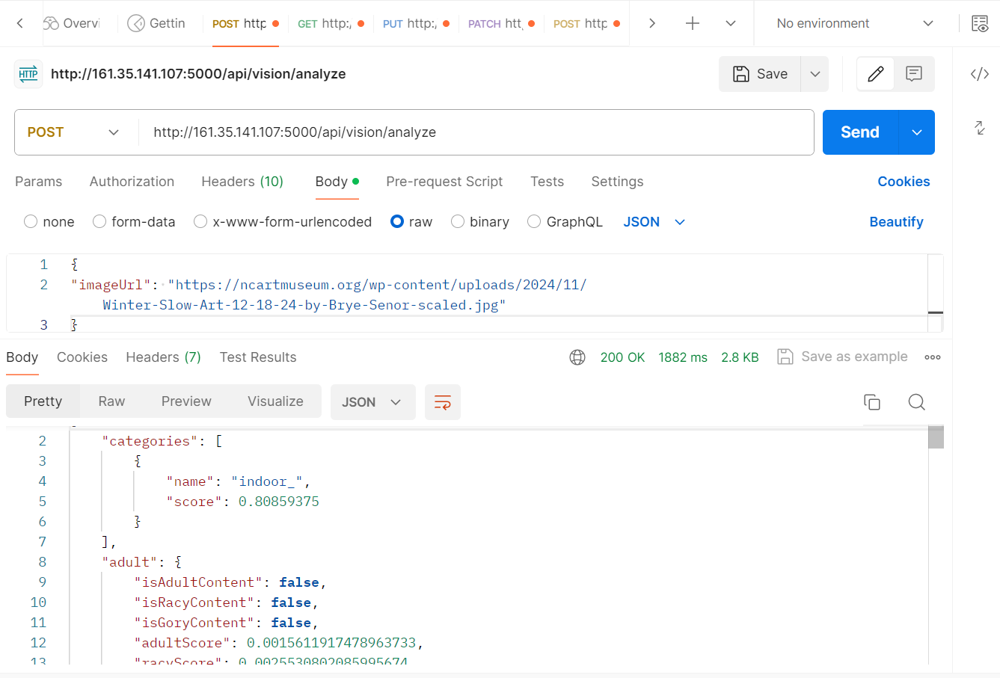
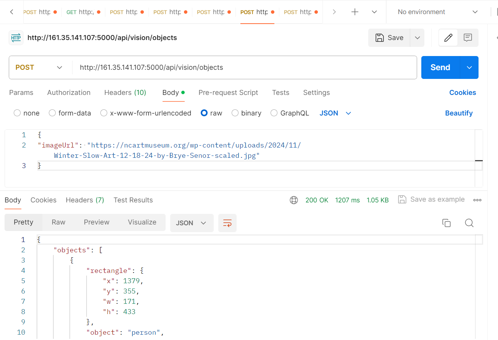
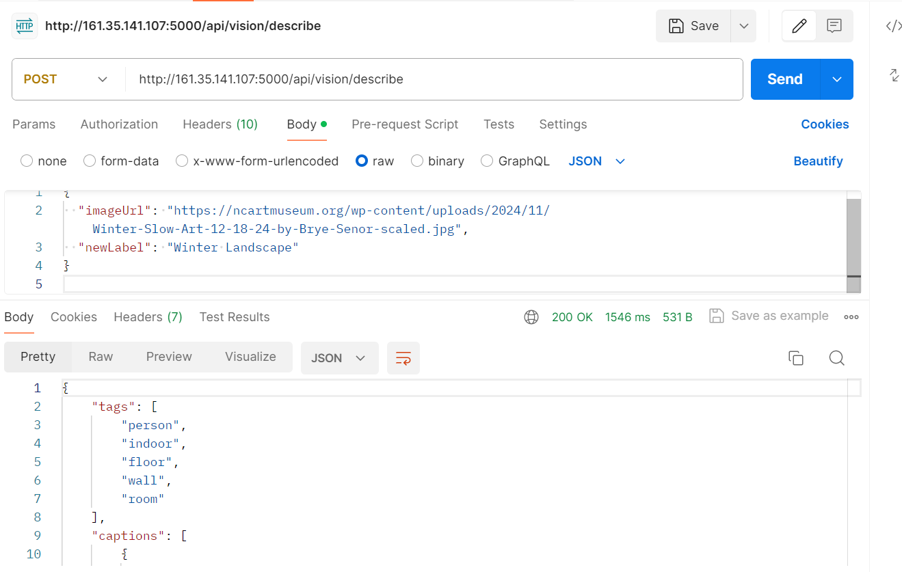
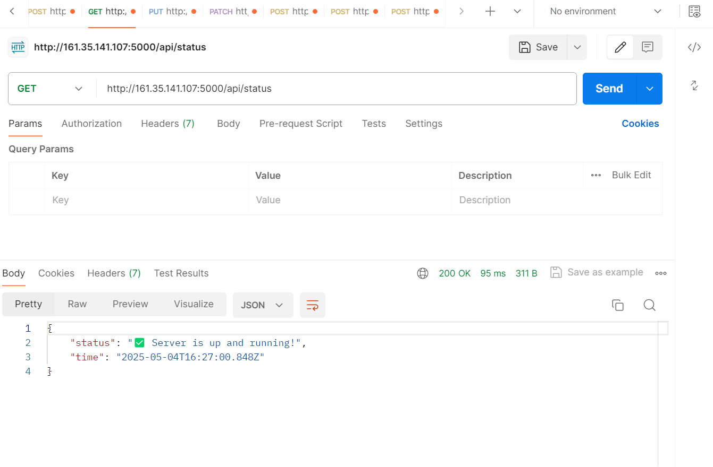
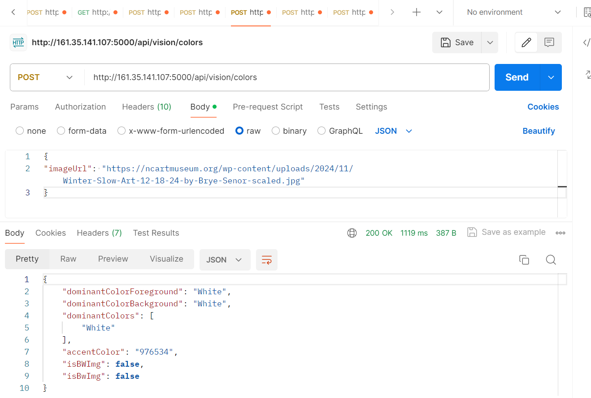
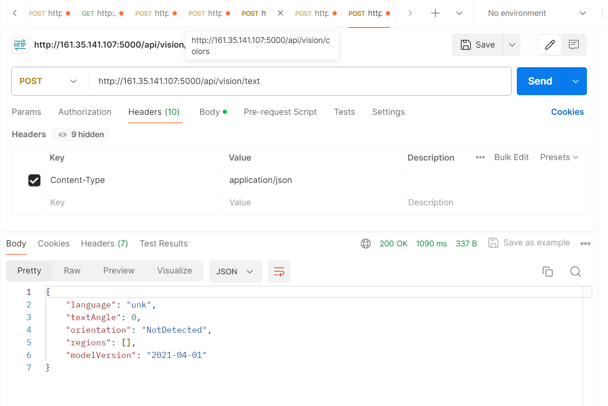
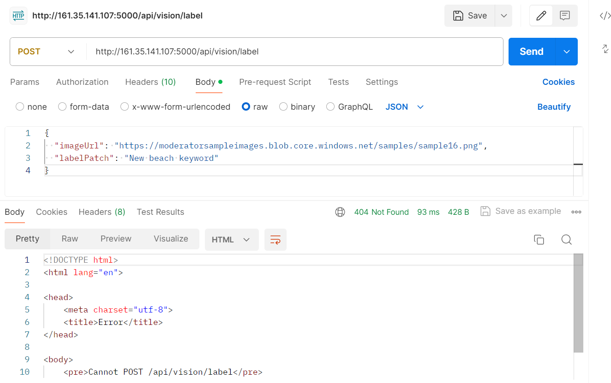
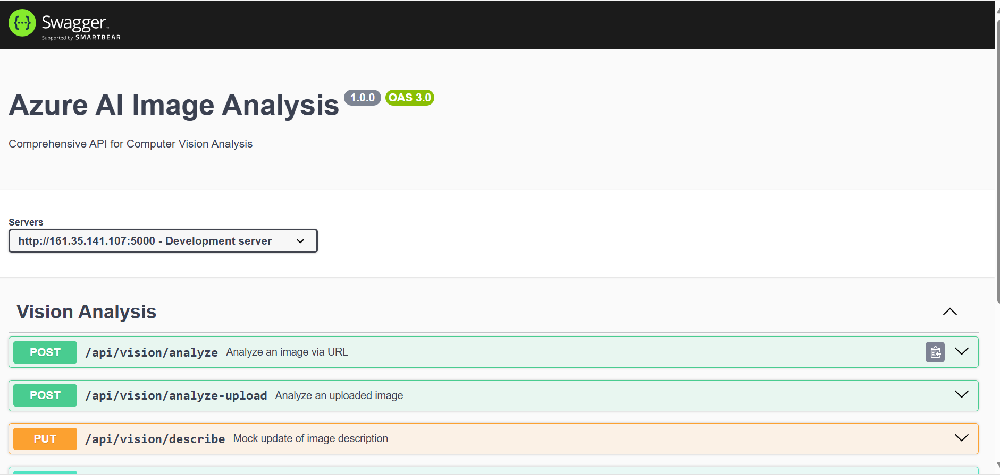

# Azure AI Image Analysis API

A powerful Express.js-based REST API that utilizes Microsoft Azure's Computer Vision services to analyze and extract insights from images via URL or file upload. This service supports multiple endpoints for detecting colors, tags, objects, faces, printed text, and more.

## Overview

This API is Developed on the Express.js framework, this API seamlessly incorporates with Azure Cognitive Services, providing robust capabilities for image analysis.

The Azure AI Image Analysis API enables developers to:  

Extract detailed information from images.  
Detect and recognize objects, faces, tags, and colors.  
Recognize printed text and landmarks.  
Generate image descriptions.  

## 📘 API Documentation
The complete Swagger UI is available at:
http://161.35.141.107:5000/api-docs

## Setup and Requirements
## Prerequisites

1.Install Node.js (v14 or higher)  
2.Ensure you have npm installed in your system and run the following command  

# npm install express @azure/cognitiveservices-computervision @azure/ms-rest-azure-js dotenv swagger-jsdoc swagger-ui-express   

3.Azure Cognitive Services account with the Computer Vision resource.  
## **  When creating Azure AI services, registering for Microsoft.Cdn is required  
To register Microsoft.Cdn:  

In Azure Portal:  

Go to Subscriptions,  
Select your subscription,  
Click on Resource providers,  
Search for "Microsoft.Cdn",  
Click "Register"   
 

## Environment Variables
4.Create a .env file in your project root with the following keys:  

AZURE_API_KEY=your_azure_api_key  
AZURE_ENDPOINT=https://example.azure.com/  
API_BASE_URL=http://localhost:5000  
PORT=5000    
5. Set up the API code in the app.js file

## Steps to run the project with pm2

## Prerequisites

1.GitHub account with your project repository  
2.DigitalOcean account  
3.Node.js and npm installed on your local machine  

## Deployment Steps
1.Push your project to GitHub  
2.Log in to your DigitalOcean account and create a new Droplet  
3.Connect to your Droplet via SSH and create a project directory  
       mkdir foldername  
4.Clone your repository  
        git clone https://github.com/username/repository.git  
5.Install all the dependencies and set up the application  
6.Start your application using PM2  
        pm2 start app.js  


It will be accessible at     
Server at `http://161.35.141.107:5000/`  
API Documentation at `http://161.35.141.107:5000/api-docs/`  

## 📌 Endpoints Overview

### 1. Analyze (All-in-one)
- **POST** `/api/vision/analyze`
- Analyze an image from URL with multiple features including faces, categories, objects, etc.
  

### 2. Objects
- **POST** `/api/vision/objects`
- Detect objects and their coordinates in the image.
  

### 3. Describe
- **PUT** `/api/vision/describe`
- Get a textual description of the image.
  

### 4. status
- **GET** `/api/vision/status`
- Detect wheather the server running or not gives status.
  
  

### 5. Colors
- **POST** `/api/vision/colors`
- Extract dominant foreground/background colors and accent color.
  


### 6. Text (OCR)
- **POST** `/api/vision/text`
- Extract printed text from an image using Azure OCR.
  

---

## 🛠️ Mock Label Endpoints

These endpoints are for testing purposes and demonstrate RESTful operations:

### 7. Patch Label (Mock)
- **PATCH** `/api/vision/label`
- Partially update image label (simulated).
   

---

## 🚀 How to Run Locally

1. Clone the repository
2. Install dependencies:
   ```bash
   npm install
   ```
3. Create a `.env` file with:
   ```env
   AZURE_API_KEY=your_azure_key
   AZURE_ENDPOINT=your_azure_endpoint
   PORT=5000
   API_BASE_URL=http://localhost:5000
   ```
4. Run the server:
   ```bash
   node app.js
   ```
5. Visit: `http://localhost:5000/api-docs`

---

## 📂 Folder Structure

```
.
├── app.js
├── uploads/
├── .env
├── package.json
├── README.md
```

---

## 📸 Swagger Screenshot
 

---

## ✍️ Author

Developed by [Bharadwaaja]


### ✅ Analyze URL
**POST** `/api/vision/analyze`

**Request Body:**
```json
{
  "imageUrl": "https://example.com/sample.jpg"
}
```

**Response:**
```json
{
  "description": { "captions": [ { "text": "a man riding a horse", "confidence": 0.95 } ] },
  "tags": [ "outdoor", "person", "horse" ],
  "faces": [ { "age": 32, "gender": "Male", "faceRectangle": { "left": 200, "top": 100, "width": 50, "height": 50 } } ],
  "color": {
    "dominantColorForeground": "White",
    "dominantColorBackground": "Green",
    "accentColor": "7C4B2A",
    "isBWImg": false
  }
}
```


---

### 🟨 Color Analysis
**POST** `/api/vision/colors`

**Request Body:**
```json
{
  "imageUrl": "https://example.com/image.jpg"
}
```

**Sample Response:**
```json
{
  "dominantColorForeground": "Black",
  "dominantColorBackground": "Gray",
  "dominantColors": ["Black", "Gray"],
  "accentColor": "B34700",
  "isBWImg": false
}
```

---

## ❗ Error Handling

| Status Code | Description                              | Example Trigger                      |
|-------------|------------------------------------------|--------------------------------------|
| 400         | imageUrl is missing or invalid           | `{}` or bad URL format               |
| 415         | Unsupported media type (file upload)     | Wrong form field or file format      |
| 500         | Internal server error                    | Azure API failure or config issue    |

---

## 📦 Environment Setup

Create a `.env` file in the root directory:

```env
AZURE_API_KEY=your_azure_subscription_key
AZURE_ENDPOINT=https://<your-region>.api.cognitive.microsoft.com/
PORT=5000
API_BASE_URL=http://localhost:5000
```

---

## 🚧 Future Improvements

- Add authentication to secure endpoints.
- Add support for handwritten text (OCR v3).
- Cache frequent image results.
- Add frontend preview using React or simple HTML.

---

## 🧠 Tech Stack

- **Node.js + Express** for backend API
- **Azure Cognitive Services** for Computer Vision
- **Swagger (OpenAPI)** for interactive docs
- **Multer** for image upload handling

---
